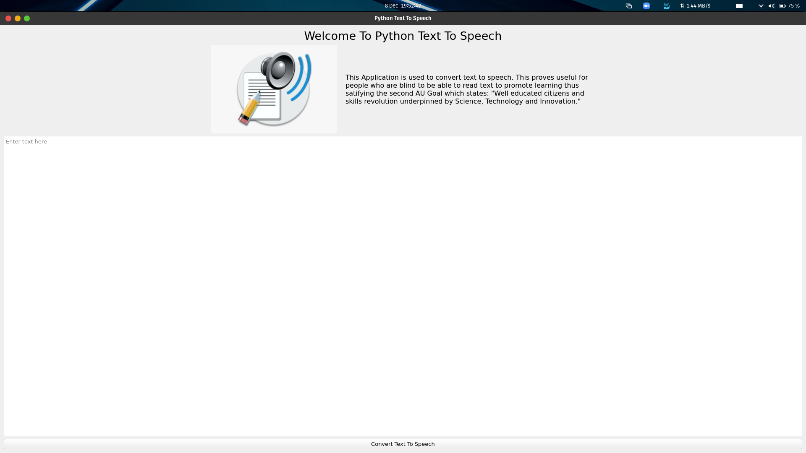

# text2speech-gui
A school project work - Convert text to speech in python


## Running on your local machine
* First clone the repository:
  ```bash
  git clone https://github.com/DaveSaah/text2speech-gui.git
  ```
  Or download the zip file by clicking on the code button and select download zip; and later extract it on your machine.

* Install the required libraries and modules
  ```bash
  pip install -r requirements.txt
  ```

* Run the code
  ```bash
    python app.py
  ```

## Screenshots

